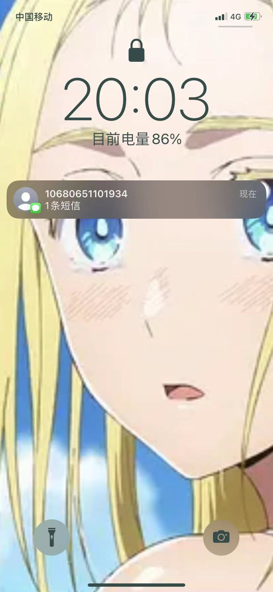
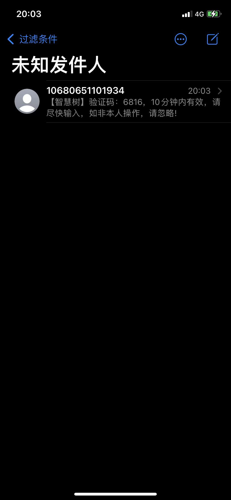
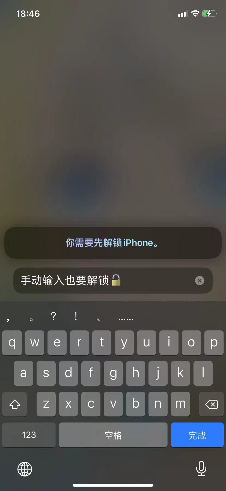
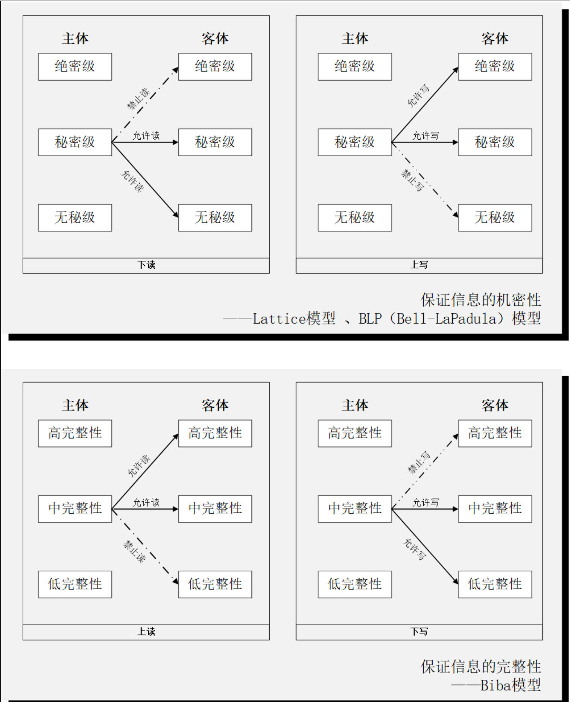
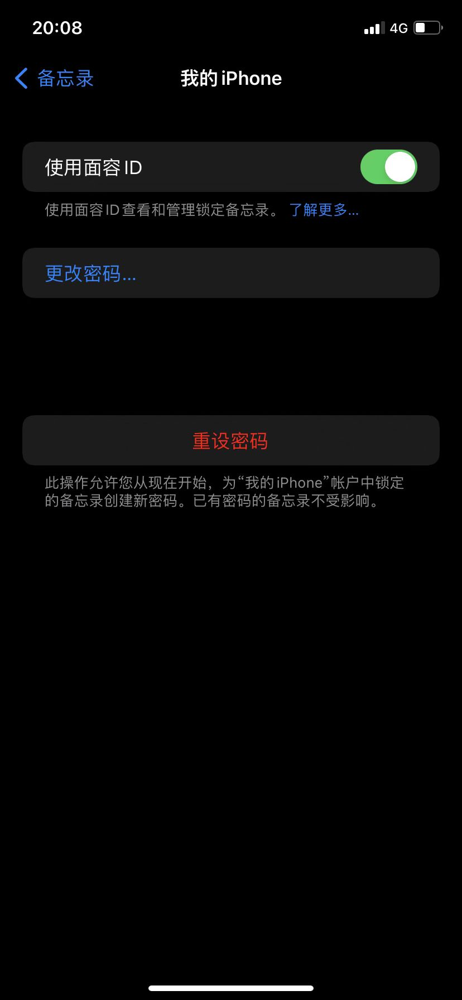
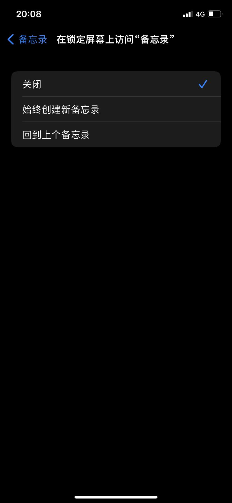
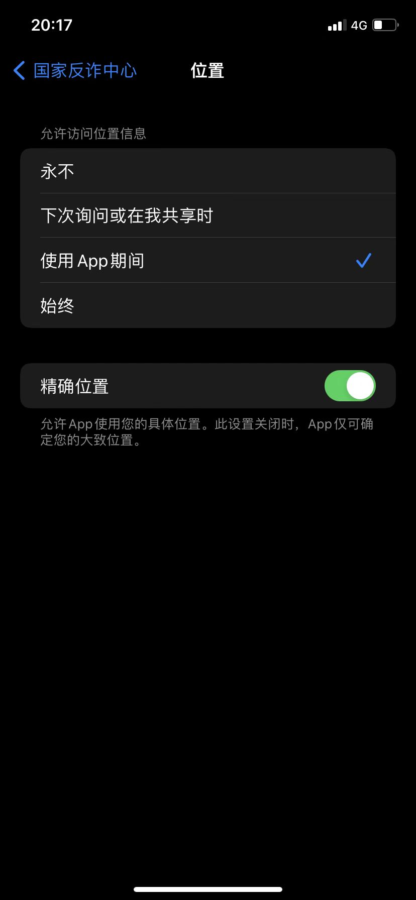
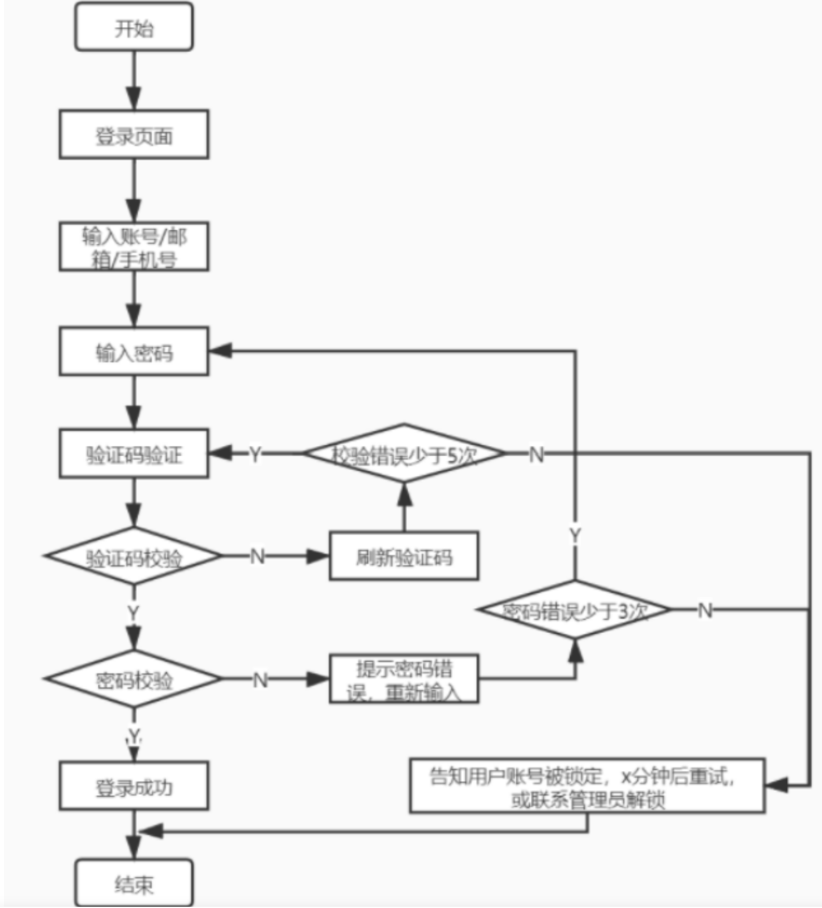
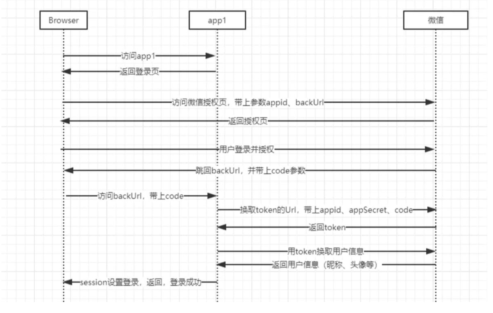

# 操作系统的访问控制设计实例研究

## 实验目的

---

通过 iOS 或Android 系统为研究对象，进行访问控制的实例研究

## 实验环境

---

- iphone11 15.6.1 ios系统
- 序列号：C8PZX51QN741
- 为默认设置
## 实验内容及结果

---
实操题：

- 以 iOS 系统为研究对象
  - 当系统处于锁屏状态下接收到新短信时，不解锁情况下
    - 系统是否允许查看短信内容？ **否**
    
    在智慧树网页点击忘记密码，通过手机号找回密码获取验证码时，不解锁手机是看不到短信内容的
    - 系统是否允许回复短信？ **否**
      
    要回复短信需要人脸识别解锁，可直接眺至上图。
    - 安卓上的 App : 以 微信电话本 为例，在接管了系统短信功能和权限之后，是否会有一些不同的功能设定？  
    会显示需要修改手机默认设置，若使用系统自带，则仍然只可读而不可回复
  - 当系统处于锁屏状态下，使用 iOS 的 Siri 可以完成以下哪些操作？
    - 访问通讯录 **否**  
    
    - 拨打电话 **是**
    - 访问相册 **否**
    - 查看短信收件箱 **否**
  - 如果你的手机支持指纹识别解锁手机，请实验并分析指纹识别相比较于简单密码、复杂密码、图形解锁、人脸识别解锁、声纹解锁等解锁方式的安全性、便利性差异。  

  |密码类型|	安全性	|便利性|
  |:---:|:---:|:---:|
  |简单密码|	小于指纹解锁，可被分析破解或者统计破解	|容易记住，比较方便|
  |复杂密码	|分析破解更不容易，但是安全性还是没有指纹高|	输入较为麻烦，记忆也不方便|
  |图形解锁	|有可能被穷举分析，指纹则不存在此种攻击方式	|解锁需要画图，相较指纹不容易|
  |人脸识别解锁	|人脸识别主要是特征识别，安全性在特征唯一的情况下可以保证	|方便，只需要人脸对着摄像头即可，但是可能受光线的影响|
  |声纹解锁 |	容易伪造|	需要说话，在安静的环境不方便|
  |指纹解锁	|指纹不容易出现重复，复制指纹不容易实现，安全性较好|	比较方便，手指一按就解锁，但是有时候手湿会影响准确性|

思考题：

- 以上设计实现方式属于我们课堂上讲过的哪种强制访问控制模型?Lattice/BLP？Biba？  
答：Lattice/BLP（允许上写下读）Biba(允许上读下写)  

Lattice/BLP模型：未解锁时不能读信息（上读不被允许），解锁后才能查看并回复短信（下读和上写允许）
- 系统或第三方应用程序是否提供了上述功能的访问控制规则修改？如果修改默认配置，是提高了安全性还是降低了安全性？  
答：系统提供了上述访问控制的修改。以备忘录为例：

备忘录中往往记录了口令密码等敏感的信息，第一张图可以关闭使用面容ID，但这明显降低了安全性。  
第二张图看似可以让备忘录修改成锁屏时可见，但经过我的尝试之后，发现依然要解锁后才能查看，ios系统对敏感信息的保护是有一定的安全原则的。  
此外，我们也可以在设置里面关闭位置共享这一私密信息，提高安全性，当然，如果是使用地图导航那肯定是不能这么做的。

课后题：

1生物特征身份认证方式有哪些？优缺点分析？应用场景举例。
- 指纹识别：

  - 指纹识别的优点

    1）指纹是人体独一无二的特征，并且它们的复杂度足以提供用于鉴别的足够特征。

    2）如果想要增加可靠性，只需登记更多的指纹，鉴别更多的手指，最多可以达到十个，而每一个指纹都是独一无二的。

    3）扫描指纹的速度很快，使用非常方便。

    4）读取指纹时，用户必须将手指与指纹采集头互相接触，与指纹采集头直接接触是读取人体生物特征最可靠的方法，这也是指纹识别技术能够占领大部分市场的一个主要原因。

    5）指纹采集头可以更加小型化，并且价格会更加低廉。

  - 指纹识别的缺点

    1）某些人或某些群体的指纹因为指纹特征很少，故而很难成像。

    2）过去因为在犯罪记录中使用指纹，使得某些人害怕“将指纹记录在案”。然而，实际上现在的指纹鉴别技术都可以保证不存储任何含有指纹图像的数据，而只是存储从指纹中得到的加密的指纹特征数据。

    3）每一次使用指纹时都会在指纹采集头上留下用户的指纹印痕，而这些指纹痕迹存在被用来复制指纹的可能性。

  - 应用场景：
    
    1）公司员工上班考勤指纹签到

    2）手机指纹解锁

- 声音识别
  - 声音识别的优点：

    1）蕴含声纹特征的语音获取方便、自然，声纹提取可在不知不觉中完成，因此使用者的接受程度也高；

    2）获取语音的识别成本低廉，使用简单，一个麦克风即可，在使用通讯设备时更无需额外的录音设备；

    3）适合远程身份确认，只需要一个麦克风或电话、手机就可以通过网路（通讯网络或互联网络）实现远程登录；

    4）声纹辨认和确认的算法复杂度低；

    5）配合一些其他措施，如通过语音识别进行内容鉴别等，可以提高准确率；……等等。这些优势使得声纹识别的应用越来越收到系统开发者和用户青睐，声纹识别的世界市场占有率15.8%，仅次于指纹和掌纹的生物特征识别，并有不断上升的趋势。

  - 声音识别的缺点：

    1）同一个人的声音具有易变性，易受身体状况、年龄、情绪等的影响；
    
    2）不同的麦克风和信道对识别性能有影响；
    
    3）环境噪音对识别有干扰；
    
    4）混合说话人的情形下人的声纹特征不易提取

  - 应用场景：

    1）ios自带的语音助手

    2）电子声控

- 视网膜识别：
  - 视网膜技术的优点：

    1）视网膜是一种极其固定的生物特征，因为它是“隐藏“的，故而不可能磨损，老化或是为疾病影响。

    2）使用者不需要和设备进行直接的接触。

  - 视网膜技术的缺点：

    1）视网膜技术未经过任何测试。

    2）视网膜技术可能会给使用者带来健康的损坏，这需要进一步的研究。

    3）对于消费者，视网膜技术没有吸引力。很难进一步降低它的成本 。

- 虹膜识别：
  - 优点

    1）便于用户使用；

    2）可能会是最可靠的生物识别技术；

    3）不需物理的接触；

    4）可靠性高。

  - 缺点：

    1）很难将图像获取设备的尺寸小型化；

    2）设备造价高，无法大范围推广；

    3）镜头可能产生图像畸变而使可靠性降低；

  - 应用场景：
    
    1）门禁考勤：扫描虹膜就能实现通道控制、开/锁门的和考勤管理，虹膜考勤识别迅速，无需接触，不能被假冒和替代打卡

    2）煤炭行业：虹膜识别技术最初就大量应用在煤炭行业，这是由煤炭行业工种的特殊性和工作环境所决定的——工人面部、指纹等其他生物特征容易受到损毁和破坏而导致辨识不清
    
    3）金融机构

    4）社保生存认证：虹膜识别养老金发放中的生存认证系统具有独特性、不可替代性、防假冒和生物活性等特性，可以准确无误的掌握生存人数，解决养老金发放中的异地验证问题及冒领、冒用甚至骗保等社保难题，有效提高了办事效率，防止错误发生

- 人脸识别技术：
  - 优势：

    1）人脸识别作为一种新兴的生物特征识别技术（Biometrics），与虹膜识别、指纹扫描、掌形扫描等技术相比，人脸识别技术在应用方面具有独到的优势：

    2）使用方便，用户接受度高人脸识别技术使用通用的摄像机作为识别信息获取装置，以非接触的方式在识别对象未察觉的情况下完成识别过程。

    3）直观性突出人脸识别技术所使用的依据是人的面部图像，而人脸无疑是肉眼能够判别的最直观的信息源，方便人工确认、审计，“以貌取人”符合人的认知规律。

    4）识别精确度高，速度快与其它生物识别技术相比，人脸识别技术的识别精度处于较高的水平，误识率、拒认率较低。

    5）不易仿冒在安全性要求高的应用场合，人脸识别技术要求识别对象必须亲临识别现场，他人难以仿冒。人脸识别技术所独具的活性判别能力保证了他人无法以非活性的照片、木偶、蜡像来欺骗识别系统。这是指纹等生物特征识别技术所很难做到的。举例来说，用合法用户的断指即可仿冒合法用户的身份而使识别系统无从觉察。

    6）使用通用性设备人脸识别技术所使用的设备为一般的PC、摄像机等常规设备，由于计算机、闭路电视监控系统等已经得到了广泛的应用，因此对于多数用户而言使用人脸识别技术无需添置大量专用设备，从而既保护了用户的原有投资又扩展了用户已有设备的功能，满足了用户安全防范的需求。

    7）基础资料易于获得人脸识别技术所采用的依据是人脸照片或实时摄取的人脸图像，因而无疑是最容易获得的。

    8）成本较低，易于推广使用由于人脸识别技术所使用的是常规通用设备，价格均在一般用户可接受的范围之内，与其它生物识别技术相比，人脸识别产品具有很高的性能价格比。

  - 缺点：

    1）面部识别被认为是生物特征识别领域甚至人工智能领域最困难的研究课题之一。面部识别的困难主要是面部作为生物特征的特点所带来的。

    2）相似性不同个体之间的区别不大，所有的面部的结构都相似，甚至面部器官的结构外形都很相似。这样的特点对于利用面部进行定位是有利的，但是对于利用面部区分人类个体是不利的。

    3）易变性面部的外形很不稳定，人可以通过脸部的变化产生很多表情，而在不同观察角度，面部的视觉图像也相差很大，另外，面部识别还受光照条件（例如白天和夜晚，室内和室外等）、面部的很多遮盖物（例如口罩、墨镜、头发、胡须等）、年龄等多方面因素的影响。

  - 应用场景：
    
    1）利用人脸识别技术保障小区安全

    2）利用人脸识别协助公司做考勤

    3）无人零售店、便利店、生活超市、连锁超市

2.“找回口令功能”和“忘记密码”在访问授权机制中的意义？请尝试设计几种安全的“找回口令功能”，详细描述找回口令的用户具体操作过程。

- 意义：可以防止该账号的数据永久丢失

- 设计：
  - 通过邮箱找回密码
    - 客户端发起找回密码申请，填写申请账号时关联的邮箱
    - 若用户真实存在（已注册），服务端向用户填写的邮箱发送验证码
    - 用户填写验证码后验证成功后，就可以重置账户密码了。

  - 通过手机号找回密码
    - 客户端发起找回密码申请，填写申请账号时关联的手机号
    - 若用户真实存在（已注册），服务端向用户填写的手机号发送验证码
    - 用户填写验证码后验证成功后，就可以重置账户密码了。

3.绘制用户使用用户名/口令+图片验证码方式录系统的流程图。考虑认证成功和失败两种场景，考虑授权成功和失败两种场景。

4.Windows XP / 7 中的访问控制策略有哪些？访问控制机制有哪些？

- 访问控制策略
  - 自主访问控制
  - 强制访问控制
  - 基于角色的访问控制
- 访问控制机制
  - （身份）认证
  - （访问）授权
  - （访问）审计

5.用权限三角形模型来理解并描述下 2 种威胁模型：提权、仿冒。

- 提权（Elevation of privilege）是指本来没有某项权限的用户，通过一定的方法获得该权限，简而言之，用户以自己的身份获得了本不属于自己的权限。

- 仿冒是指用户A以用户B的身份通过了认证，之后行使了B所有的权利

6.试通过操作系统的访问控制机制来达到预防一种真实病毒的运行目的。

7.什么是 OAuth？
- 概念：  
OAuth是一个关于授权（authorization）的开放网络标准，在全世界得到广泛应用。
- 工作原理：
  >OAuth在"客户端"与"服务提供商"之间，设置了一个授权层（authorization layer）。"客户端"不能直接登录"服务提供商"，只能登录授权层，以此将用户与客户端区分开来。"客户端"登录授权层所用的令牌（token），与用户的密码不同。用户可以在登录的时候，指定授权层令牌的权限范围和有效期。
  >
  >"客户端"登录授权层以后，"服务提供商"根据令牌的权限范围和有效期，向"客户端"开放用户储存的资料。
- 具体流程：

（A）用户打开客户端以后，客户端要求用户给予授权。  
（B）用户同意给予客户端授权。  
（C）客户端使用上一步获得的授权，向认证服务器申请令牌。  
（D）认证服务器对客户端进行认证以后，确认无误，同意发放令牌。（E）客户端使用令牌，向资源服务器申请获取资源。  
（F）资源服务器确认令牌无误，同意向客户端开放资源。  
OAuth协议为用户资源的授权提供了一个安全的、开放而又简易的标准。与以往的授权方式不同之处是OAuth的授权不会使第三方触及到用户的帐号信息（如用户名与密码），即第三方无需使用用户的用户名与密码就可以申请获得该用户资源的授权，因此OAuth是“安全的”。同时，任何第三方都可以使用OAuth认证服务，任何服务提供商都可以实现自身的OAuth认证服务，因而OAuth是“开放的”。

8.什么是 OpenID？
  
OpenID 是一个以用户为中心的数字身份识别框架，是一个以URL为身份标识的分散式身份验证解决方案，它具有开放、分散、自由等特性。

9.试用本章所学理论分析 0Auth 和 OpenID 的区别与联系。

OpenID是Authentication；  
OAuth是Authorization。  
前者是网站对用户进行认证，让网站知道“你是你所声称的URL的属主”；  
后者其实并不包括认证，只不过“只有认证成功的人才能进行授权”，结果类似于“认证+授权”了。OAuth相当于：A网站给B网站一个令牌，然后告诉B网站说根据这个令牌你可以获取到某用户在A网站上允许你访问的所有信息，如果A网站需要用B网站的用户系统进行登录，
- 它可以选择OpenID认证，然后通过attribute exchange获取用户的昵称或其他通过OpenID暴露出来的用户属性，
- 选择OAuth认证，获取到token后再用token获取用户昵称或其他允许被访问的信息。

10.如何使用 OAuth 和 OpenID 相关技术实现单点登录（Single Sign On）？
- 单点登录：
  >单点登录的英文名叫做：Single Sign On（简称SSO）。
  >
  >单点登录 (SSO) 是一种对于许多相互关连，但是又是各自独立的软件系统，提供访问控制的属性。当拥有这项属性时，当用户登录时，就可以获取所有系统的访问权限，不用对每个单一系统都逐一登录。
  >
  >简单来说，单点登录就是在多个系统中，用户只需一次登录，各个系统即可感知该用户已经登录。
  >
  >比如阿里系的淘宝和天猫，很明显地我们可以知道这是两个系统，但是你在使用的时候，登录了天猫，淘宝也会自动登录。
  >
  >[单点登录](https://zhuanlan.zhihu.com/p/66037342)

## 备注

---

第六题和第十题的第二小问未给出解答。

## 参考资料

---

- [操作系统的访问控制设计实例研究](https://blog.csdn.net/lemonalla/article/details/105592186)

- [六种生物识别技术原理及缺点](https://www.sohu.com/a/123436445_468626)

- [OpenID 和 OAuth 有什么区别？](https://www.zhihu.com/question/19628327/answer/12591409)

- [openid](https://www.cnblogs.com/iskyoole/articles/2659273.html)

- [单点登录](https://zhuanlan.zhihu.com/p/66037342)