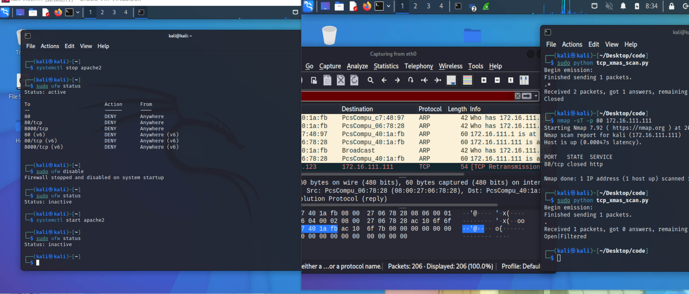

# 实验五：基于 Scapy 编写端口扫描器

## 实验目的

---
- 掌握网络扫描之端口状态探测的基本原理

## 实验环境

---
- python 3.9.2
- scapy 2.4.4
- nmap 7.91
- virtualbox_kali_debina

## 实验要求

---
- 禁止探测互联网上的 IP ，严格遵守网络安全相关法律法规
- 完成以下扫描技术的编程实现
  - TCP connect scan / TCP stealth scan
  - TCP Xmas scan / TCP fin scan / TCP null scan
  - UDP scan
- 上述每种扫描技术的实现测试均需要测试端口状态为：开放、关闭 和 过滤 状态时的程序执行结果
- 提供每一次扫描测试的抓包结果并分析与课本中的扫描方法原理是否相符？如果不同，试分析原因；
- 在实验报告中详细说明实验网络环境拓扑、被测试 IP 的端口状态是如何模拟的

## 实验拓扑


|主机|	ip地址	|物理地址/网卡|
|:---:|:---:|:---:|
|网关debina	|172.16.111.1|	08:00:27:c7:48:97/enp0s9|
|攻击者kali	|172.16.111.123|	08:00:27:40:1a:fb/eth0|
|受害者kali	|172.16.111.111|08:00:27:06:78:28/eth0|


## 实验过程

---

### 端口状态模拟

- 查看当前防火墙的状态和现有规则
  ```
  ufw status
  ```

- 关闭状态：对应端口没有开启监听, 防火墙没有开启。
  ```
  ufw disable
  ```
  
- 开启状态：对应端口开启监听: apache2基于TCP, 在80端口提供服务; DNS服务基于UDP,在53端口提供服务。防火墙处于关闭状态。
  ```
  systemctl start apache2 # port 80
  systemctl start dnsmasq # port 53
  ```
- 过滤状态：对应端口关闭监听, 防火墙开启。
  ```
  ufw enable && ufw deny 80/tcp
  ufw enable && ufw deny 53/udp
  ```

### TCP Connect scan

>这种扫描方式可以使用 Connect()调用，使用最基本的 TCP 三次握手链接建立机制，建立一个链接到目标主机的特定端口上。首先发送一个 SYN 数据包到目标主机的特定端口上，接着我们可以通过接收包的情况对端口的状态进行判断：如果接收到的是一个 SYN/ACK 数据包，则说明端口是开放状态的；如果接收到的是一个 RST/ACK 数据包，通常意味着端口是关闭的并且链接将会被重置；而如果目标主机没有任何响应则意味着目标主机的端口处于过滤状态。

**code**
```python
from scapy.all import *


def tcpconnect(dst_ip, dst_port, timeout=10):
    pkts = sr1(IP(dst=dst_ip)/TCP(dport=dst_port,flags="S"),timeout=timeout)
    if pkts is None:
        print("Filtered")
    elif(pkts.haslayer(TCP)):
        if(pkts.getlayer(TCP).flags == 0x12):  #Flags: 0x012 (SYN, ACK)
            send_rst = sr(IP(dst=dst_ip)/TCP(dport=dst_port,flags="AR"),timeout=timeout)
            print("Open")
        elif (pkts.getlayer(TCP).flags == 0x14):   #Flags: 0x014 (RST, ACK)
            print("Closed")

tcpconnect('172.16.111.111', 80)
```

**nmap复刻**
```python
nmap -sT -p 80 172.16.111.123
```

1. 端口关闭
```
sudo ufw disable
```


可以看到接收到的是一个 RST/ACK 数据包，意味着端口是关闭的
- nmap复刻


2. 端口开放
```
  systemctl start apache2 && sudo ufw disable
```


可以看到接收到的是一个 SYN/ACK 数据包，则说明端口是开放状态的

- nmap复刻

3. 端口过滤
```
sudo ufw enable && sudo ufw deny 80/tcp #打开防火墙且关闭80端口
```


- nmap复刻

### TCP stealth scan

>先发送一个S，然后等待回应。如果有回应且标识为RA，说明目标端口处于关闭状态；如果有回应且标识为SA，说明目标端口处于开放状态。这时TCP stealth scan只回复一个R，不完成三次握手，直接取消建立连接。

**code**
```python
from scapy.all import *


def tcpstealthscan(dst_ip, dst_port, timeout=10):
    pkts = sr1(IP(dst=dst_ip)/TCP(dport=dst_port, flags="S"), timeout=10)
    if (pkts is None):
        print("Filtered")
    elif(pkts.haslayer(TCP)):
        if(pkts.getlayer(TCP).flags == 0x12):
            send_rst = sr(IP(dst=dst_ip) /
                          TCP(dport=dst_port, flags="R"), timeout=10)
            print("Open")
        elif (pkts.getlayer(TCP).flags == 0x14):
            print("Closed")
        elif(pkts.haslayer(ICMP)):
            if(int(pkts.getlayer(ICMP).type) == 3 and int(stealth_scan_resp.getlayer(ICMP).code) in [1, 2, 3, 9, 10, 13]):
                print("Filtered")


tcpstealthscan('172.16.111.111', 80)
```
**nmap复刻**
```python
nmap -sT -p 80 172.16.111.111
```
1. 端口关闭


- nmap复刻


2. 端口开放


- nmap 


3. 端口过滤


- nmap 


### TCP Xmas scan

>一种隐蔽性扫描，当处于端口处于关闭状态时，会回复一个RST包；其余所有状态都将不回复。

code
```python
from scapy.all import *


def Xmasscan(dst_ip, dst_port, timeout=10):
    pkts = sr1(IP(dst=dst_ip)/TCP(dport=dst_port, flags="FPU"), timeout=10)
    if (pkts is None):
        print("Open|Filtered")
    elif(pkts.haslayer(TCP)):
        if(pkts.getlayer(TCP).flags == 0x14):
            print("Closed")
    elif(pkts.haslayer(ICMP)):
        if(int(pkts.getlayer(ICMP).type) == 3 and int(pkts.getlayer(ICMP).code) in [1, 2, 3, 9, 10, 13]):
            print("Filtered")


Xmasscan('172.16.111.111', 80)
```
1. 端口关闭


- nmap复刻


2. 端口开放


- nmap 


3. 端口过滤


- nmap 


### TCP FIN scan

>仅发送FIN包，FIN数据包能够通过只监测SYN包的包过滤器，隐蔽性较SYN扫描更⾼，此扫描与Xmas扫描也较为相似，只是发送的包未FIN包，同理，收到RST包说明端口处于关闭状态；反之说明为开启/过滤状态。

code
```python
#! /usr/bin/python
from scapy.all import *


def finscan(dst_ip, dst_port, timeout=10):
    pkts = sr1(IP(dst=dst_ip)/TCP(dport=dst_port, flags="F"), timeout=10)
    if (pkts is None):
        print("Open|Filtered")
    elif(pkts.haslayer(TCP)):
        if(pkts.getlayer(TCP).flags == 0x14):
            print("Closed")
    elif(pkts.haslayer(ICMP)):
        if(int(pkts.getlayer(ICMP).type) == 3 and int(pkts.getlayer(ICMP).code) in [1, 2, 3, 9, 10, 13]):
            print("Filtered")


finscan('172.16.111.111', 80)
```

1. 端口关闭


- nmap复刻


2. 端口开放


- nmap 


3. 端口过滤


- nmap 


### TCP NULL scan
>发送的包中关闭所有TCP报⽂头标记，实验结果预期还是同理：收到RST包说明端口为关闭状态，未收到包即为开启/过滤状态.

code
```python
#! /usr/bin/python
from scapy.all import *


def nullscan(dst_ip, dst_port, timeout=10):
    pkts = sr1(IP(dst=dst_ip)/TCP(dport=dst_port, flags=""), timeout=10)
    if (pkts is None):
        print("Open|Filtered")
    elif(pkts.haslayer(TCP)):
        if(pkts.getlayer(TCP).flags == 0x14):
            print("Closed")
    elif(pkts.haslayer(ICMP)):
        if(int(pkts.getlayer(ICMP).type) == 3 and int(pkts.getlayer(ICMP).code) in [1, 2, 3, 9, 10, 13]):
            print("Filtered")


nullscan('172.16.111.111', 80)
```
1. 端口关闭


- nmap复刻


2. 端口开放


- nmap 


3. 端口过滤


- nmap 


### UDP scan
>一种开放式扫描，通过发送UDP包进行扫描。当收到UDP回复时，该端口为开启状态；否则即为关闭/过滤状态.

code
```python
from scapy.all import *
def udpscan(dst_ip, dst_port, dst_timeout=10):
    resp = sr1(IP(dst=dst_ip)/UDP(dport=dst_port), timeout=dst_timeout)
    if (resp is None):
        print("Open|Filtered")
    elif (resp.haslayer(UDP)):
        print("Open")
    elif(resp.haslayer(ICMP)):
        if(int(resp.getlayer(ICMP).type) == 3 and int(resp.getlayer(ICMP).code) == 3):
            print("Closed")
        elif(int(resp.getlayer(ICMP).type) == 3 and int(resp.getlayer(ICMP).code) in [1, 2, 9, 10, 13]):
            print("Filtered")
        elif(resp.haslayer(IP) and resp.getlayer(IP).proto == IP_PROTOS.udp):
            print("Open")
udpscan('172.16.111.111', 53)
```

nmap
```
nmap -sU -p 53 172.16.111.111
```

1. 端口关闭


- nmap复刻


2. 端口开放/过滤


- nmap 


## 问题与思考

---
- kali victim1没有自带ufw，但是直接用kali默认的国外的源下载会很慢
  解决：提高kali权限输入 vim /etc/apt/sources.list  进入软件源进行编辑，换成国内的阿里云源即可：  
  ```
  deb http://mirrors.aliyun.com/kali kali-rolling main non-free contrib
  deb-src http://mirrors.aliyun.com/kali kali-rolling main non-free contrib
  ```  
  具体见：[kali更换国内源](https://blog.csdn.net/CTF_zhang/article/details/122513604)

- 1.扫描方式与端口状态的对应关系  

|扫描方式\端口状态	|开放|	关闭|	过滤|
|:---:|:---:|:---:|:---:|
|TCP connect / TCP stealth	|完整的三次握手，能抓到ACK&RST包|	只收到一个RST包	|收不到任何TCP包|
|TCP Xmas / TCP FIN / TCP NULL|	收不到TCP回复包	|收到一个RST包	|收不到TCP回复包|
|UDP	|收到UDP回复包	|收不到UDP回复包	|收不到UDP回复包|

- 提供每一次扫描测试的抓包结果并分析与课本中的扫描方法原理是否相符？如果不同，试分析原因；  
抓包截图上面已给出。  
基本相符。

- 通过本章网络扫描基本原理的学习，试推测应用程序版本信息的扫描原理，和网络漏洞的扫描原理。
  - **应用程序版本信息的扫描原理：**  
  对应用程序自身的安全检查有：静态扫描和动态扫描  
    - 静态扫描：就是对源码进行代码语法和逻辑的安全漏洞检查。  
    第一代静态扫描的原理方式有2中：AST（抽象语法树）扫描、正则匹配扫描。详见：[静态代码扫描方法及工具介绍](https://www.itcodemonkey.com/article/13892.html)  
    第二代静态扫描的原理方式：参考：[代码扫描](https://baike.baidu.com/item/%E4%BB%A3%E7%A0%81%E6%89%AB%E6%8F%8F/1903104?fr=aladdin)
    - 动态扫描：就是对运行的系统，进行安全漏洞检查。扫描起始目标为：站点的url。
  - **网络漏洞的扫描原理:** 漏洞扫描技术是建立在端口扫描技术的基础之上的，从对黑客的攻击行为的分析和收集的漏洞来看，绝大多数都是针对某一个特定的端口的，所以漏洞扫描技术以与端口扫描技术同样的思路来开展扫描的。  
  漏洞扫描技术的原理是通过远程检测目标主机TCP/IP不同端口的服务，记录目标的回答。通过这种方法，可以搜集到很多目标主机的各种信息。在获得目标主机TCP/IP端口和其对应的网络访问服务的相关信息后，与网络漏洞扫描系统提供的漏洞库进行匹配，如果满足匹配条件，则视为漏洞存在。此外，通过模拟黑客的进攻手法，对目标主机系统进行攻击性的安全漏洞扫描，如测试弱势口令等，也是扫描模块的实现方法之一。如果模拟攻击成功，则视为漏洞存在。

- 网络扫描知识库的构建方法有哪些？  
网络安全知识库的构建过程主要涉及领域本体的构建和知识库的构建两部分，在本体构建方面，网络安全领域已经存在了很多已有的本体，抽象出一些攻击相关的实体类。知识库的构建根据知识源的不同分为两类，一部分是整合现有的知识库，这些主要是结构化数据，可以使用一些自动化的工具来完成这项工作，另一部分是从非结构化文本中提取网络安全相关实体，在网络安全知识库的构建过程中，有些进程会占用太多的系统资源，使系统运行缓慢。为此，我们提出了一种面向网络安全的知识库构建方法投入使用，以解决上述问题。  
详细见：[一种面向网络安全的知识库构建方法与流程](https://www.xjishu.com/zhuanli/55/201811081912.html)


## 参考资料

- [icmp](https://blog.csdn.net/baidu_37964071/article/details/80514340)

- [nmap](https://zhuanlan.zhihu.com/p/343709343)

- [Nmap端口扫描的六种状态介绍](https://blog.csdn.net/m0_37268841/article/details/80234365)

- [启动、关闭和设置ubuntu防火墙 ufw 的使用](https://blog.csdn.net/chongdi2612/article/details/100733464)

- [kali更换国内源](https://blog.csdn.net/CTF_zhang/article/details/122513604)

- [ajian的神奇仓库](https://github.com/CUCCS/2022-ns-public-Kled-Skaarl/blob/chap0x05/README.md)
